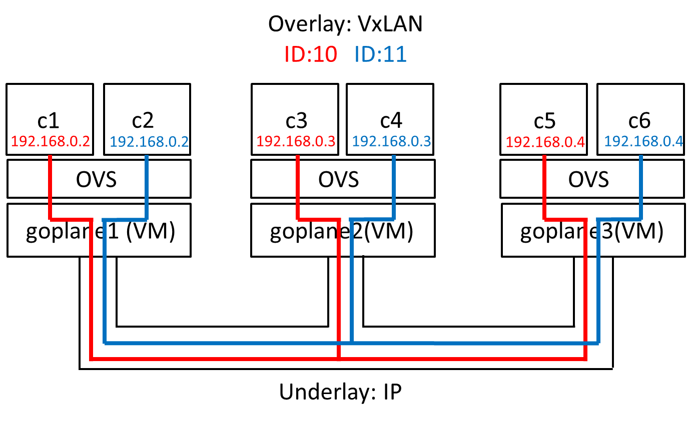

Goplane open BUM-less L2 overlay demo
===

This demo shows how to build a BUM-less L2 overlay network by Goplane without using any vendor specific hardware/software.

## How to run
1. The demo requires capability of running 64 bit guest operating systems (most of the modern Windows PCs and MACs satsify this requirement)

2. Install dependet tools. Note that these tools, including  non-free ones, are for easy-to-use demos and not required for open BUM-less networking itself.
 - [Oracle Virtual Box](https://www.virtualbox.org/)
 - [Vagrant](https://www.vagrantup.com/)

3. Move to goplane/test/ovs directory and execute

     ```
     vagrant up
     ```


## How to play
In this demo, 3 VMs (goplane1 to goplane3) and 6 containres (2 containers/VM) are booted and connected in the following topology.



Let's see that goplane achieves a BUM less networking. Open a terminal and execute the following commands

    $ vagrant ssh goplane2
    vagrant@goplane2:~$ sudo docker exec -it c4 tcpdump -vvv

Open another terminal and hit as follows (note that it's not the same as above)

    $ vagrant ssh goplane3
    vagrant@goplane3:~$ sudo docker exec -it c5 tcpdump -vvv

You have logged in to c4 (192.168.0.3 on VxLAN '11') and c5 (192.168.0.4 on VxLAN '10'), and packets coming to each container are being captured by tcpdump.

Now let's ping between c1 and c3 and see how BUM packets are suppressed.

    $ vagrant ssh goplane1
    vagrant@goplane1:~$ sudo docker exec -it c1 ping 192.168.0.3
    PING 192.168.0.3 (192.168.0.3) 56(84) bytes of data.
    64 bytes from 192.168.0.3: icmp_seq=1 ttl=64 time=0.478 ms
    64 bytes from 192.168.0.3: icmp_seq=2 ttl=64 time=0.793 ms
    64 bytes from 192.168.0.3: icmp_seq=3 ttl=64 time=0.634 ms
    64 bytes from 192.168.0.3: icmp_seq=4 ttl=64 time=0.810 ms
    64 bytes from 192.168.0.3: icmp_seq=5 ttl=64 time=0.789 ms
    ...

While pinging, you get nothing on the both tcpdump results.
The two tcpdump looks the same, but they have different meanings:

1. No packets in the c4 (192.168.0.3 on VxLAN 11) console means that VxLAN segmentation is successfully done. Because you ping'ed to 192.168.0.3 on VxLAN '10', no packets must arrive to this container even though the IP addresses are the same.
2. No packets in the c5 (192.168.0.4 on VxLAN 10) console means the overlay network is fully BUM-less.
Normally, c1 must broadcast an ARP requrest to every containers in the same segment before it can start pinging and everytime the ARP table expires.
This broadcasting increses CPU load for replicating the packet and making the network congested (the BUM problem).
In this demo, ARP packets are not broadcated nor replicated because the OVS in each host knows {IP, Mac, VxLAN tag} pairs and act as a proxy arp responder (in other words, an ARP packet sent from a container is just "hit back" at the OVS).

## Look deeper inside
This section explains how the BUM-less overlay network is build using Open vSwitch (OVS) and Border Gateway Protocol (BGP).
The basic ideas are:

1. All hosts (goplane1, 2 and 3) are peered with BGP and all {IP, Mac, VxLAN tag} mappings are advertised by BGP when a container is invoked.
2. The OVS in each host is then configured to send packts to the exact port beyond which the destination container exists.

First, type the below command to see the OVS port connection inside goplane1.

    $ vagrant ssh goplane1
    vagrant@goplane1:~$ sudo ovs-ofctl show docker0-ovs | grep addr
     1(vxlan-10.9.9.3): addr:46:42:f5:b2:18:6c
     2(vxlan-10.9.9.4): addr:f2:80:a7:6a:4f:18
     3(o00ac0a80002): addr:f2:80:a7:6a:4f:18
     4(o00bc0a80002): addr:06:91:84:c9:06:45
     LOCAL(docker0-ovs): addr:06:91:84:c9:06:45

The numbers on the first characters show the port numbers used inside OVS.
goplane 2 (10.9.9.3) and goplane3 (10.9.9.4) are connected to port 1 and port 2, respectively, through VxLAN.
Port 3 and port 4 are for containers running inside goplane1, and in this demo port 3 is for c1.

Given the port settings above, let's see how tenant isolation is achieved.

    vagrant@goplane1:~$ sudo ovs-ofctl dump-flows docker0-ovs | grep 03 | grep vlan=10 | grep -v arp
    cookie=0x0, duration=12412.524s, table=1, n_packets=0, n_bytes=0, idle_age=12412, priority=50,dl_vlan=10,dl_dst=02:42:c0:a8:00:03 actions=output:1

This command shows the open flow rule for packets that have VxLAN tag 10 and destination mac address 02:42:c0:a8:00:03.
In the demo, c3 and c4 are assigned the mac address 02:42:c0:a8:00:03 (note that as they are in different tenants, this is highly possible to occur in real cases).
Packets matching this rule are processed by two steps:

 1. Remote port selection: The packets are sent to port 1 because port 1 is connected to goplane2 (10.9.9.3) where c3 is hosted.
 2. Local port selection: The packets received are delivered only to c3 thanks to rules of OVS in goplane2 that are similar to the ones we saw above for goplane1.

Next, let's move on to how ARP requrests are handled inside OVS.
The below command picks up open flow matching rules that is related to ARP packets for 192.168.0.3 with VxLAN tag 10.

    vagrant@goplane1:~$ sudo ovs-ofctl dump-flows docker0-ovs | grep arp | grep 192.168.0.3 | grep vlan=10
    cookie=0x0, duration=10531.261s, table=1, n_packets=0, n_bytes=0, idle_age=10531, priority=100,arp,dl_vlan=10,arp_tpa=192.168.0.3 actions=move:NXM_OF_ETH_SRC[]->NXM_OF_ETH_DST[],mod_dl_src:02:42:c0:a8:00:03,load:0x2->NXM_OF_ARP_OP[],move:NXM_NX_ARP_SHA[]->NXM_NX_ARP_THA[],move:NXM_OF_ARP_SPA[]->NXM_OF_ARP_TPA[],load:0x242c0a80003->NXM_NX_ARP_SHA[],load:0xc0a80003->NXM_OF_ARP_SPA[],strip_vlan,IN_PORT

The only two important things you should see are as follows (if you want to fully understand those fancy rules, see [this website](http://assafmuller.com/2014/05/21/ovs-arp-responder-theory-and-practice/)).

 1. This rule modifies a received ARP request to the corresponding ARP response,
 2. and sends the reponse to the port where the request came (IN_PORT), instead of replicating and broadcasting it to ouside world.

